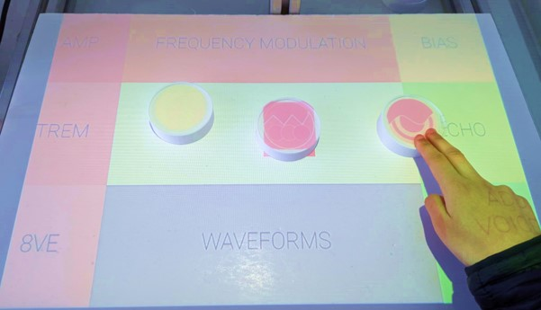

# Synesthesia Synthesizer

Final year MEng Electronic and Information (EIE) project. This project implements an augmented reality synthesizer experience by using physical objects to represent notes. Various shapes, colours and animations are projected onto these objects to create a synesthetic mapping between sight and sound. 

## File Directory

- **Backend**: Image and audio processing scripts, created using python.
- **Frontend**: User-facing application using electron-react-typescript framework.
- **Objects**: .stl files used to hold up a projector.